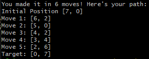

# Binary-Trees-Ruby
An example of binary search trees with knight's travails and a node graph, both in Ruby.
Knight's Travails shows a breadth first search.
The BST shows four methods of searching. 

How to Use: Download the files and run them in your favorite CLT/console with ruby. You may edit the inputs at the bottom of each script for different results.

Knight's Travails

Binary Search Tree (BST)

Knight Travails to-do Improvements - Print each optimal path instead of just one.
